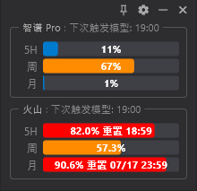
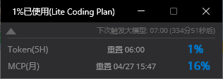
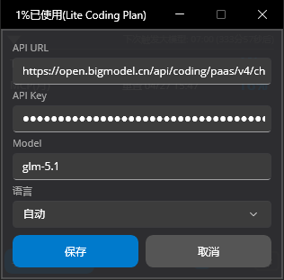
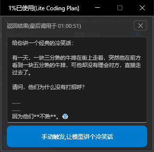

English | [中文](README.md)

# Coding Plan Time Refresh

A .NET MAUI desktop utility that periodically calls LLM APIs and displays API usage percentages on the interface. Primarily used to keep the Zhipu BigModel coding plan quota active.

## Preview

| Normal View | Collapsed View |
|:---:|:---:|
|  |  |

| Settings Panel | Trigger Popup |
|:---:|:---:|
|  |  |

## Features

- Scheduled automatic LLM triggering (01:00, 07:00, 13:00, 19:00, checked every 6 seconds)
- Manual LLM trigger
- Streaming display of LLM responses
- Real-time BigModel usage quota display (5H / Weekly / Monthly) — currently supports Zhipu Coding Plan only; other platforms to be added later
- Always-on-top, collapse/expand window
- Encrypted config storage (AES-256-CBC)
- Chinese/English UI switching
- Windows (WinUI 3) and macOS (MacCatalyst) support

## Requirements

- .NET 10.0 SDK
- Windows 10 1809+ or macOS 15.0+

## Build & Run

```bash
# Build (Windows)
dotnet build CodingPlanTimeRefresh/CodingPlanTimeRefresh.csproj -f net10.0-windows10.0.19041.0

# Run (Windows)
dotnet run --project CodingPlanTimeRefresh/CodingPlanTimeRefresh.csproj -f net10.0-windows10.0.19041.0

# Publish (Windows, self-contained)
dotnet publish CodingPlanTimeRefresh/CodingPlanTimeRefresh.csproj -f net10.0-windows10.0.19041.0 -c Release -r win-x64

# Build (Mac)
dotnet build CodingPlanTimeRefresh/CodingPlanTimeRefresh.csproj -f net10.0-maccatalyst
```

Or use the publish scripts in the project root:

- `publish-win.bat` — Windows self-contained publish with cleanup
- `publish-mac.sh` — macOS publish

## Configuration

On first run, a configuration panel will appear. Fill in:

- **API URL** — OpenAI-compatible chat endpoint (e.g. `https://open.bigmodel.cn/api/paas/v4/chat/completions`)
- **API Key** — Your API key
- **Model** — Model name (default `glm-5.1`)

Configuration is encrypted and stored in `data/config.dat`.

## Project Structure

```
CodingPlanTimeRefresh/
├── App.xaml.cs              # Window lifecycle management
├── MainPage.xaml(cs)        # Main UI and logic
├── LLMService.cs            # LLM calls and usage queries
├── ConfigService.cs         # Encrypted config read/write
├── AppConfig.cs             # Config model
├── LogService.cs            # Logging service
├── Resources/Strings/       # Chinese/English resource files
└── Platforms/               # Platform-specific code
```

## Flutter Edition (Multi-provider Refactor)

This repo is undergoing a Flutter multi-provider refactor (under `codingplan_refresh/`). The MAUI edition is slated for removal later. The following describes the Flutter edition, which coexists with the MAUI edition above.

### Supported Providers

- **Zhipu BigModel** (bigmodel.cn): queries usage quota via HTTP.
- **Volcengine Ark** (ark.cn-beijing.volces.com): queries usage via the local `arkcli` tool.

### Volcengine Ark Usage Prerequisites

Volcengine Ark usage querying relies on the official `arkcli` CLI. Install and log in first:

1. Install arkcli (see https://console.volcengine.com/ark/region:cn-beijing/docs/82379/2536875 )
2. Run `arkcli auth login` to complete login
3. The app queries automatically via `arkcli usage plan`

If not installed / not logged in, the Volcengine Ark usage frame shows "arkcli 未安装，参考 README".

#### Login Credential Expiry

The `arkcli` login credential (refresh_token) has an expiration. If arkcli has not been used for a long time (neither keeping the app running for periodic polling nor manually running arkcli commands), the credential may expire. The Volcengine Ark usage frame then shows:

> 登录凭证已过期，请重新执行 arkcli auth login

To fix it, re-run login once in the terminal:

```bash
arkcli auth login
```

After logging in, the next usage poll (within 60 seconds) resumes automatically.

### Configuration (Multiple)

- Main UI ☰ menu → Settings: manage multiple model configs (long-press drag to reorder, add, delete, edit).
- Each config fills in: Name, API URL, API Key, Model (Zhipu: model name like `glm-5.1`; Volcengine: endpoint id like `ep-xxx`).
- Provider is auto-detected from the API URL.

### Build

```bash
cd codingplan_refresh
flutter build windows --release
```

See [codingplan_refresh/README.md](codingplan_refresh/README.md) for details.

## License

[MIT](LICENSE)
